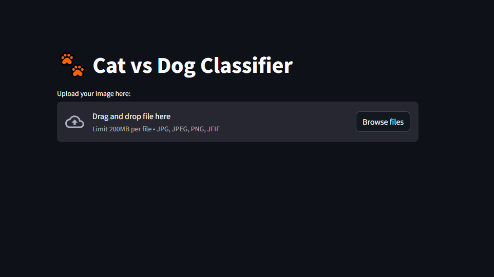
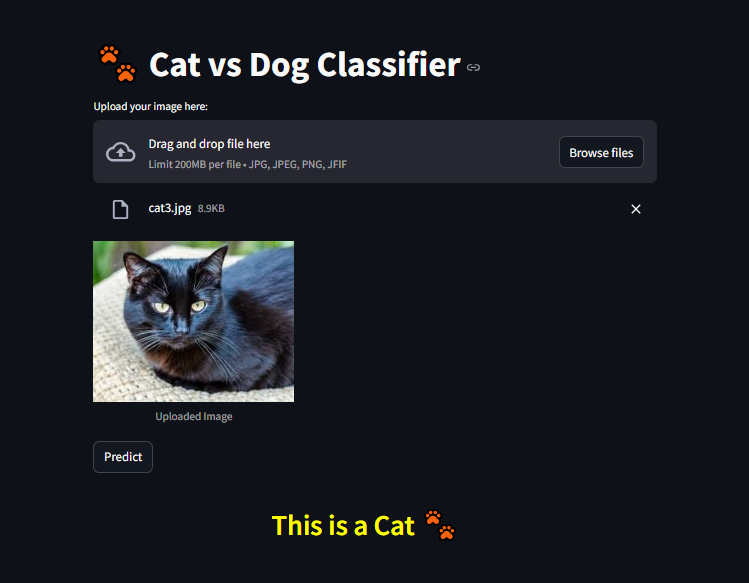

# Cat-Dog Classifier 🐱🐶

This project is a deep learning-based application designed to classify images of cats and dogs. It uses a pre-trained model and offers an intuitive interface with **Streamlit**.

---

## 🚀 Features

- **Image Upload Mode**: Upload an image to classify it as a cat or a dog.
- **Real-Time Camera Mode**: Use your webcam to classify live images of cats and dogs.
- **Deep Learning Model**: Built with TensorFlow using transfer learning for high accuracy.
- **Streamlit Interface**: Simple and easy-to-use interface.

---

## 📥 Dataset

The model was trained on the **Dogs vs Cats** dataset from Kaggle.  
Download it [here](https://www.kaggle.com/datasets/salader/dogs-vs-cats).

---

### 🛠 Installation

1. Install dependencies:
   You can install all necessary dependencies using the following command:

   `pip install -r requirements.txt`

   This will ensure that all required libraries are installed in your environment.

## 📊 Model Training
The model uses transfer learning with the **ResNet50** architecture. The training process is detailed in a Jupyter notebook included in the repository.

---

## 🖼 Screenshots
- **Home Page:**
  
  
- **Upload Mode:**
  

---

## 🤝 Contribution
Contributions are welcome!  
Feel free to fork this repository, create an issue, or submit a pull request.

---

## 📜 License
This project is licensed under the MIT License.

---

## 📬 Contact
For any questions or feedback, reach out at:  
**nikitbisht1859@gmail.com**

